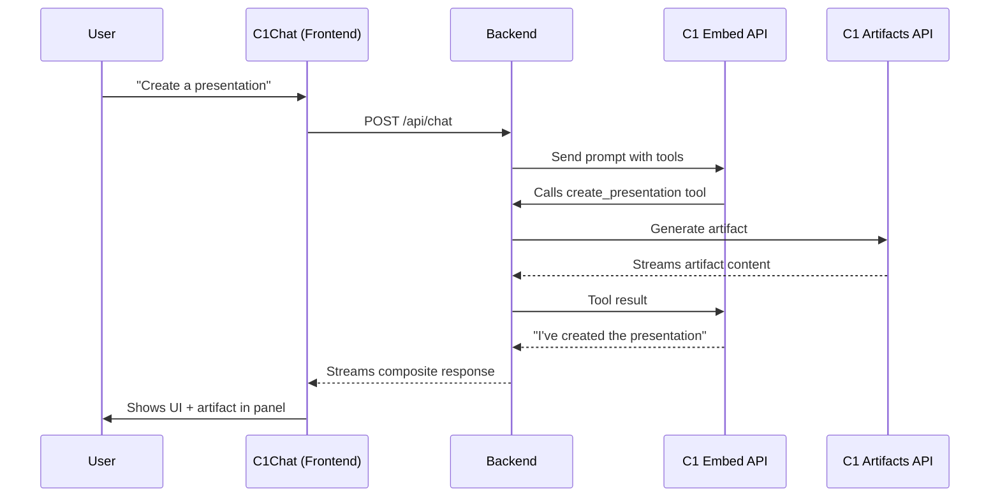

# C1Chat with Artifacts

A Next.js example demonstrating how to use the `C1Chat` component with artifact support. This example shows how to build a presentation and document assistant that can generate slides, reports, and other artifacts using Thesys's generative UI capabilities.

## Features

- 🎨 **Full Chat Experience**: Complete chatbot interface with message history, input composer, and streaming responses
- 📊 **Artifact Support**: Automatically displays generated artifacts (slides, reports, etc.) in a dedicated panel
- 🔄 **Iterative Editing**: Continue conversations to refine and update artifacts
- 🎯 **Simple Setup**: Uses the out-of-the-box `C1Chat` component with minimal configuration

## Setup

1. Set your Thesys API key in the environment:

```bash
export THESYS_API_KEY=your_api_key_here
```

2. Install dependencies and start the dev server:

```bash
npm install
npm run dev
```

3. Open the app in your browser and start creating artifacts!

## How it Works

### Backend (`/api/chat`)

The API route implements the **Artifacts in Chat** pattern using tool calling:

1. **Tool-Based Workflow**: Uses `runTools` to automatically handle tool calls
2. **Four Tools Provided**:
   - `create_presentation` - Creates new slide presentations
   - `create_report` - Creates new report documents
   - `edit_presentation` - Edits existing presentations
   - `edit_report` - Edits existing reports

3. **Dual API Integration**:
   - **C1 Embed API** (`/v1/embed`) - Main LLM for chat and tool orchestration
   - **C1 Artifacts API** (`/v1/artifact`) - Specialized model for generating/editing artifacts

4. **Message History & Versioning**:
   - Maintains conversation history in-memory (per thread)
   - Each message has a unique ID that serves as its "version"
   - Edit operations retrieve old content by version to send to the Artifacts API

5. **Streaming Response**:
   - Uses `makeC1Response()` to assemble the final response
   - Artifacts stream directly into the C1 Response
   - LLM confirmation text streams after tool execution
   - Frontend receives a single, composite message with both text and artifact

### Frontend

The frontend uses the `C1Chat` component with artifact configuration:
- `artifactViewMode`: Set to `AUTO_OPEN` to automatically display artifacts
- `agentName`: Customizes the assistant's display name
- All chat functionality is handled by the component (composer, message display, streaming, etc.)

## Key Files

- `src/app/page.tsx` - Main page with C1Chat component
- `src/app/api/chat/route.ts` - Main API route with tool calling and artifact handling
- `src/app/api/chat/tools.ts` - Tool definitions for creating and editing artifacts
- `src/app/api/chat/systemPrompt.ts` - System prompt instructing LLM to use tools

## Example Prompts

### Creating Artifacts
- "Create a 10-slide product launch presentation"
- "Generate a quarterly business review report"
- "Make a presentation about AI and machine learning"
- "Create a report on market analysis for Q4"

### Editing Artifacts
After creating an artifact, you can edit it with follow-up prompts:
- "Add a slide about our competitors"
- "Make the conclusion more compelling"
- "Add a section about risks and mitigation"
- "Change the color scheme to be more professional"

## Architecture

This example implements the **Artifacts in Chat** pattern:


