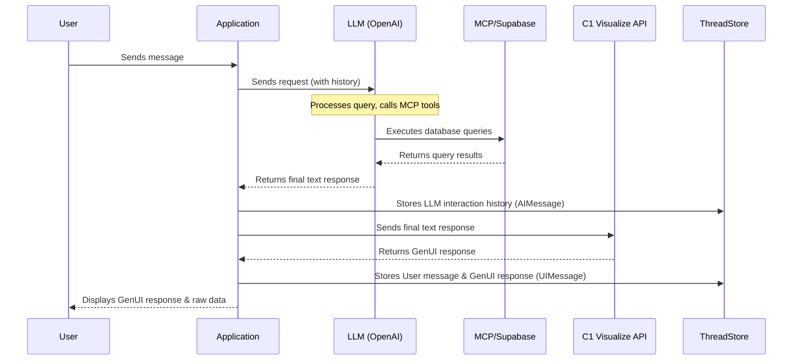

# C1 Visualize Data Analyst

Example Next.js project with Thesys GenUI SDK and C1 Visualize API, demonstrating how to build a data analyst assistant that queries Supabase databases using Model Context Protocol (MCP), visualizes data, and persists chat history.

[](https://thesys.dev)

### Overview

This is a data analyst assistant that helps users query, analyze, and visualize data from Supabase databases. Here's the overall flow:

1. Sends a request to an LLM (OpenAI) to generate a text/markdown response.
2. The LLM uses MCP (Model Context Protocol) tools to query a live Supabase database.
3. Sends the final LLM response (after any tool calls) to the C1 Visualize API endpoint to convert it into a Generative UI response with visualizations.
4. Stores the complete interaction history with the LLM (including requests, responses, and tool call messages) to maintain context for future interactions.
5. Stores the user messages and the corresponding Assistant Generative UI responses in the Thread Store for display and persistence across page refreshes.
6. Displays raw query results alongside visualizations for transparency.



### Setup Instructions

1. Copy `example.env` to `.env` and configure the required environment variables:

```bash
cp example.env .env
```

Required environment variables:

- `THESYS_API_KEY`: Your Thesys API key for C1 Visualize
- `OPENAI_API_KEY`: Your OpenAI API key
- `MCP_SERVER_URL`: URL of your Supabase MCP server
- `SUPABASE_ACCESS_TOKEN`: Access token for Supabase MCP authentication

2. Install dependencies:

```bash
npm install
```

3. Set up the database:

```bash
npm run prisma:migrate
npm run prisma:generate
```

4. Run the development server:

```bash
npm run dev
```

## Project Structure

```
├── src/
│   ├── app/
│   │   ├── api/              # API routes
│   │   ├── page.tsx          # Main page component
│   │   ├── layout.tsx        # Root layout
│   │   └── globals.css       # Global styles
│   ├── generated/           # Generated code
│   ├── services/           # Service layer
│   └── apiClient.ts        # API client configuration
├── prisma/                 # Database schema and migrations
├── public/                 # Static assets
├── .env                    # Environment variables
├── example.env            # Example environment variables
├── next.config.ts         # Next.js configuration
├── package.json           # Project dependencies
├── tsconfig.json         # TypeScript configuration
└── README.md             # Project documentation
```

## Features

This example is a data analyst assistant built with Next.js, Thesys GenUI SDK, Prisma, and Model Context Protocol (MCP). It allows users to:

- Query live Supabase databases using natural language
- Generate AI-powered visualizations from query results
- View raw data alongside visualizations
- Persist chat history across sessions
- Maintain conversation context for follow-up questions

### Example Prompts

```
Show me sales by product category
What are the top 5 best-selling products?
List all customers by country
Show me sales trends over time
```

### MCP Tools (`src/app/api/chat/tools.ts`)

The OpenAI assistant connects to Supabase via Model Context Protocol (MCP) and has access to Supabase MCP tools, which are dynamically discovered from the MCP server. Common tools include:

1.  **`list_tables`**:

    - **Description**: Lists all available tables in the Supabase database and their schemas.
    - **Parameters**: Optional schema names.
    - **Returns**: List of tables with their structure.

2.  **`execute_sql`**:

    - **Description**: Executes SQL queries against the Supabase database.
    - **Parameters**: SQL query string.
    - **Returns**: Query results as JSON.

3.  **Other Supabase MCP tools**:
    - Additional tools are dynamically loaded from the MCP server based on your Supabase configuration.

### Persistence

This application persists chat conversations to ensure history is maintained across sessions.

- **Database:** Uses Prisma (`prisma/schema.prisma`) to manage the database schema and interact with the underlying database (e.g., PostgreSQL). The schema defines models for `Thread`, `AIMessage`, and `UIMessage`.

- **Backend Logic (`src/services/threadService.ts`)**: This service contains the core functions for interacting with the database via Prisma to:

  - Create new chat threads.
  - Fetch existing threads and their messages.
  - Add new messages (`AIMessage` and `UIMessage`) to a specific thread.

- **API Endpoints (`src/app/api/...`)**:

  - `chat/route.ts`: Orchestrates the chat flow. After receiving responses from both OpenAI (including tool interactions) and Thesys Visualize, it calls `threadService` to save the relevant messages.
  - `thread/**` & `threads/**`: Provide RESTful APIs for the frontend to fetch the list of threads and the messages belonging to a specific thread.

- **Data Stored**: Two types of message history are stored per thread:

  - **`AIMessage`**: Stores the complete conversation history with the primary LLM (OpenAI). This includes the user's prompts, the assistant's intermediate steps, any tool calls made by the assistant (including MCP Supabase queries), and the results returned by those tools. This full history is crucial for maintaining context in subsequent calls to the OpenAI API within the same thread.
  - **`UIMessage`**: Stores the messages intended for display in the user interface. This includes the user's original prompt, the final formatted response generated by the Thesys Visualize API (which is based on the OpenAI assistant's final textual output), and raw data from database queries for display in data tables.

- **Frontend Integration (`src/app/page.tsx`)**:
  - Uses hooks like `useThreadManager` and `useThreadListManager` provided by the Thesys GenUi SDK or custom hooks.
  - These hooks interact with the backend API endpoints (`/api/thread/...`, `/api/threads/...`) to fetch the list of threads and the `UIMessage` history for the currently selected thread, rendering the conversation in the chat interface.

## Key Components

Checkout the backend code in:

1. **`src/app/api/chat/route.ts`**: Main chat route that orchestrates the flow:

   - Connects to Supabase via MCP
   - Calls OpenAI with MCP tools
   - Processes tool results and extracts raw data
   - Sends final response to C1 Visualize API
   - Persists messages to the database

2. **`src/app/api/chat/tools.ts`**: MCP client implementation:

   - Manages connection to Supabase MCP server
   - Dynamically loads available tools
   - Executes tool calls and formats results

3. **`src/app/api/thread`** and **`src/app/api/threads`**: REST APIs for Thread and Message CRUD operations

4. **`src/services/threadService.ts`**: Service layer for database operations using Prisma

5. **`src/components/RawDataModal.tsx`**: Component for displaying raw query results in a table format

## Additional Resources

- See `USAGE_EXAMPLES.md` for more example queries and use cases
- See `Visualize.md` for details about the visualization capabilities
