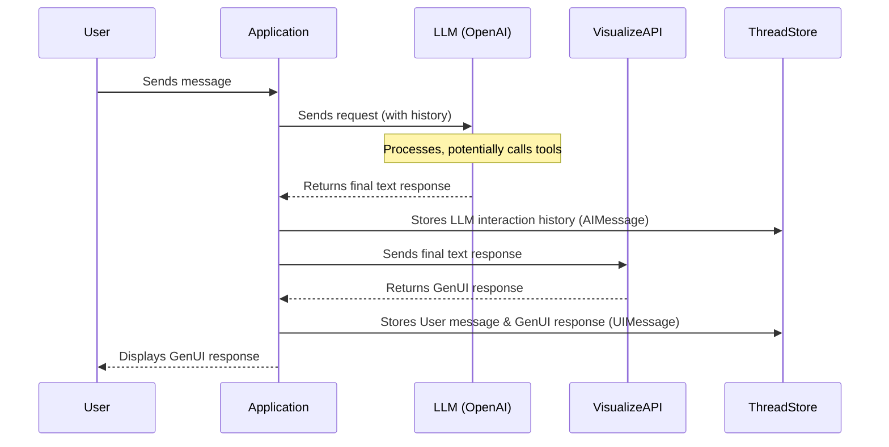

Example Next.js project with Thesys GenUI SDK with C1 Visualize api, showing how to persist chat history, threads and tool.

## C1 Visualize E-commerce Agent

### Overview

This is an example e-commerce agent using the Visualize API. Here's the overall flow:

1. Sends a request to an LLM (like OpenAI) to generate a text/markdown response.
2. Sends the final LLM response (after any tool calls) to the Visualize API endpoint to convert it into a Generative UI response.
3. Stores the complete interaction history with the LLM (including requests, responses, and tool call messages) to maintain context for future interactions.
4. Stores the user messages and the corresponding Assistant Generative UI responses in the Thread Store for display and persistence across page refreshes.


### Setup Instructions

1. copy .env.example to .env and set the THESYS_API_KEY and OPEN_API_KEY

```cp .env.example .env
```

2. install dependencies:

```bash
npm install
```

Then, run the development server:

```bash
npm run dev
```

## Project Structure

```
├── src/
│   ├── app/
│   │   ├── api/              # API routes
│   │   ├── page.tsx          # Main page component
│   │   ├── layout.tsx        # Root layout
│   │   └── globals.css       # Global styles
│   ├── generated/           # Generated code
│   ├── services/           # Service layer
│   └── apiClient.ts        # API client configuration
├── prisma/                 # Database schema and migrations
├── public/                 # Static assets
├── .env                    # Environment variables
├── example.env            # Example environment variables
├── next.config.ts         # Next.js configuration
├── package.json           # Project dependencies
├── tsconfig.json         # TypeScript configuration
└── README.md             # Project documentation
```

## Overview

This example is a simple e-commerce chat application built with Next.js, Thesys GenUI SDK, and Prisma. It allows users to have conversations with an e-commerce AI assistant, and persist the chat history. It use mock product details data.

### Example prompt

```
Show me available products
```

### LLM Tools (`src/app/api/chat/tools.ts`)

The OpenAI assistant has access to the following mock tools:

1.  **`listProducts`**:
    *   **Description**: Lists all available products with their name, ID, price, and imageUrl.
    *   **Parameters**: None.
    *   **Returns**: JSON string array of product summaries.
2.  **`getProductDetails`**:
    *   **Description**: Gets detailed information about a specific product, including description, available variants (sizes, colors, stock), and imageUrl.
    *   **Parameters**: `productId` (string).
    *   **Returns**: JSON string of the full product details (with available variants only).
3.  **`addToCart`**:
    *   **Description**: Adds a specific product variant (size/color) to the in-memory shopping cart. Checks stock availability.
    *   **Parameters**: `productId` (string), `size` (string), `color` (string), `quantity` (number).
    *   **Returns**: Confirmation message or error string.
4.  **`getCart`**:
    *   **Description**: Shows the current contents of the in-memory shopping cart, including item details and total price.
    *   **Parameters**: None.
    *   **Returns**: String describing cart contents (JSON string within the message) or an "empty cart" message.

### Persistence

This application persists chat conversations to ensure history is maintained across sessions.

*   **Database:** Uses Prisma (`prisma/schema.prisma`) to manage the database schema and interact with the underlying database (e.g., PostgreSQL). The schema defines models for `Thread`, `AIMessage`, and `UIMessage`.

*   **Backend Logic (`src/services/threadService.ts`)**: This service contains the core functions for interacting with the database via Prisma to:
    *   Create new chat threads.
    *   Fetch existing threads and their messages.
    *   Add new messages (`AIMessage` and `UIMessage`) to a specific thread.

*   **API Endpoints (`src/app/api/...`)**:
    *   `chat/route.ts`: Orchestrates the chat flow. After receiving responses from both OpenAI (including tool interactions) and Thesys Visualize, it calls `threadService` to save the relevant messages.
    *   `thread/**` & `threads/**`: Provide RESTful APIs for the frontend to fetch the list of threads and the messages belonging to a specific thread.

*   **Data Stored**: Two types of message history are stored per thread:
    *   **`AIMessage`**: Stores the complete conversation history with the primary LLM (OpenAI). This includes the user's prompts, the assistant's intermediate steps, any tool calls made by the assistant, and the results returned by those tools. This full history is crucial for maintaining context in subsequent calls to the OpenAI API within the same thread.
    *   **`UIMessage`**: Stores the messages intended for display in the user interface. This typically includes the user's original prompt and the final, formatted response generated by the Thesys Visualize API (which is based on the OpenAI assistant's final textual output).

*   **Frontend Integration (`src/app/page.tsx`)**:
    *   Uses hooks like `useThreadManager` and `useThreadListManager` provided by the Thesys GenUi SDK or custom hooks.
    *   These hooks interact with the backend API endpoints (`/api/thread/...`, `/api/threads/...`) to fetch the list of threads and the `UIMessage` history for the currently selected thread, rendering the conversation in the chat interface.

Checkout the backend code in:

1. `src/app/api/chat/route.ts` for the usage of the api/chat route to handle the tool call and persist the chat history.
2. `src/app/api/thread` and `src/app/api/threads` for Thread and Message CRUD
