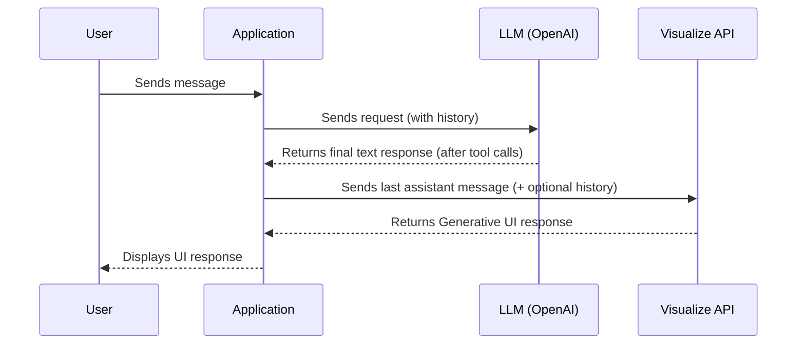

## Thesys Visualize API

### Endpoint

```
POST /v1/embed/chat/completions
```

### Overview
The Thesys Visualize API enables you to generate dynamic user interfaces based on the final output of other LLM services.

- It visualizes the **last assistant message** you provide, turning it into a rich, generative UI.
- It **does not support tool calls**.
- You can **optionally include previous conversation messages** in your request to provide more context for the visualization.
- Designed to work seamlessly with LLM workflows: after your LLM (e.g., OpenAI) completes all tool calls and generates a final response, you send that response (and optionally, the conversation history) to the Visualize API for UI generation.

This makes it easy to turn LLM-generated content into interactive user experiences, without manual UI coding.



### Request
Supports both streaming and non-streaming payloads.

### Response
Returns streaming chunks in streaming mode or a message object in non-streaming mode.

### Tip:
For best results, we recommend including a note in your system prompt to instruct the LLM to structure its final response clearly for UI generation. For example:
> “Your final response will be processed by another assistant to generate a user interface (e.g., product lists, forms). Structure your responses clearly for this purpose. If the user asks for output in a specific component (for example, a graph or table), try your best to generate the output in the requested format so that the other assistant can use it to generate the UI.”
